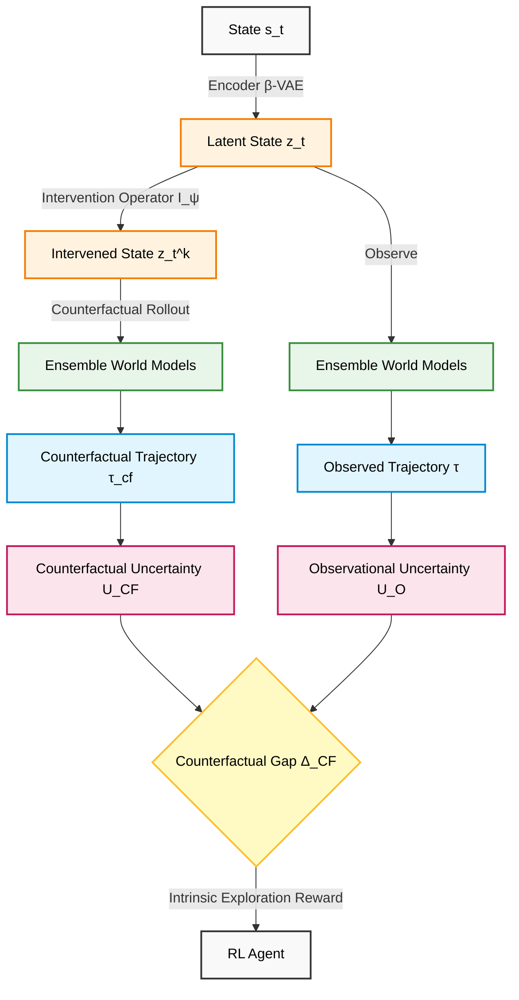

<div align="center">

# 🧠 Neural Counterfactual Trajectory Uncertainty (NCTU)
**A Counterfactual Gap-Based Exploration Framework for Model-Based Reinforcement Learning**


[Explanation](#-what-is-nctu) • [Significance](#-why-it-matters) • [Real-Life Application](#-real-life-applications) • [Architecture](#-architecture-diagram) • [Results](#-experimental-results) • [Quick Start](#-quick-start)

</div>

---

## 📖 What is NCTU?

**Neural Counterfactual Trajectory Uncertainty (NCTU)** is a novel exploration framework for model-based reinforcement learning (RL) that integrates causal reasoning with ensemble-based uncertainty estimation. 

Traditional RL agents learn purely through observation. NCTU mimics human cognition by asking "What if?" questions—reasoning about alternate realities. It utilizes latent world models and a learnable intervention operator to generate counterfactual trajectories, simulating hypothetical modifications to the environment. The system computes a **Counterfactual Gap**—the difference between uncertainty in counterfactual trajectories and observed trajectories—and uses this metric as an intrinsic reward to guide exploration.

## 💡 Why it Matters (The Significance)

Efficient exploration remains a fundamental challenge in complex environments with sparse rewards and hidden causal factors. Existing uncertainty-driven exploration methods (such as BALD or Plan2Explore) estimate uncertainty strictly over *observed* future trajectories. 

The critical flaw in conventional methods is that agreement on observed futures does not imply an understanding of *alternate* futures. An agent might prematurely conclude it has learned the environment, ignoring hidden causal variables. NCTU solves this by actively seeking states where causal understanding remains incomplete, guaranteeing continued exploration until the hidden causal mechanics are fully learned.

## 🌍 Real-Life Applications

NCTU elevates artificial intelligence to Level 3 of Pearl's Ladder of Causation (Counterfactuals), making it highly valuable for safety-critical and dynamic systems:

* **Autonomous Vehicles:** An autonomous car might perfectly navigate a sunny route, resulting in low observational uncertainty. NCTU forces the system to reason about counterfactuals—"What if the weather changed to heavy rain?"—ensuring the driving policy is robust across varying conditions (evaluated via the CARLA driving simulator).
* **Industrial Robotics:** In manufacturing, physical parameters can unexpectedly change. NCTU ensures robotic agents retain high performance and robust adaptation under heavy physical interventions (evaluated via the CausalWorld robotic benchmark).

---

## ✨ Key Features

* **The Counterfactual Gap ($\Delta_{CF}$):** A mathematically robust intrinsic reward metric capturing hidden epistemic uncertainty.
* **Disentangled Latent Interventions:** Employs a $\beta$-VAE to apply targeted structural interventions without destroying contextual integrity.
* **Gradient-Based State Synthesis:** Accelerates discovery in sparse environments by generating adversarial target states toward causally confusing regions.

---

## 📐 Architecture Diagram

The framework connects the Latent Representation Layer, Counterfactual Intervention Layer, and Ensemble World Models to calculate the Counterfactual Gap.



---

## 🧮 Mathematical Formulation

The core innovation is isolating the epistemic uncertainty that exclusively arises under intervention. The Counterfactual Gap is defined as:

$$\Delta_{CF} = I(\tau_{cf};\Theta) - I(\tau;\Theta)$$

Where:
* $I(\tau;\Theta)$ represents Observational Uncertainty (model disagreement regarding observed futures).
* $I(\tau_{cf};\Theta)$ represents Counterfactual Uncertainty (model disagreement regarding alternate futures).

The RL policy is optimized to maximize both extrinsic and intrinsic rewards:

$$\max_{\pi} J(\pi) = \mathbb{E}_{\tau\sim\pi} \left[ \sum_{t=0}^{\infty} \gamma^t (r_t^{ext} + \lambda \Delta_{CF}(s_t)) \right]$$

---

## 📊 Experimental Results

### 1. MiniGrid Exploration Coverage
In highly sparse grid-world environments (DoorKey and MultiRoom), NCTU naturally guides the agent to interact with causal bottlenecks, resulting in superior state coverage compared to state-of-the-art observational models.

| Method | DoorKey Coverage (%) | MultiRoom Coverage (%) | Success Rate |
| :--- | :---: | :---: | :---: |
| Random | 12.4 | 8.2 | 0.05 |
| ICM | 65.1 | 52.8 | 0.58 |
| Dreamer V3 | 78.4 | 68.1 | 0.76 |
| Plan2Explore | 85.2 | 74.5 | 0.82 |
| **NCTU (Ours)** | **96.8** | **89.3** | **0.95** |

*(Reference Table 8.1)*

### 2. CausalWorld Robustness
NCTU evaluates the Counterfactual Robustness Score (CRS) under heavy environmental interventions. While baseline performance collapses under intervention, NCTU retains 86% of its performance.

| Algorithm | Base Return | Intervened Return | Counterfactual Robustness Score (CRS) |
| :--- | :---: | :---: | :---: |
| RND | 845 | 310 | 0.36 |
| Dreamer V3 | 912 | 425 | 0.46 |
| Plan2Explore | 930 | 515 | 0.55 |
| **NCTU (Ours)** | **945** | **812** | **0.86** |

*(Reference Table 8.2)*

---

## 🛠️ Installation

```bash
git clone https://github.com/yourusername/NCTU.git
cd NCTU
conda create -n nctu_env python=3.9
conda activate nctu_env
pip install -r requirements.txt
```

---

## 🚀 Quick Start

Initialize and train the NCTU agent with minimal overhead:

```python
import gym
from nctu.agent import NCTUAgent
from nctu.models import EnsembleWorldModel, BetaVAE
from nctu.exploration import CounterfactualGapBonus

# 1. Initialize Sparse Reward Environment
env = gym.make('MiniGrid-DoorKey-8x8-v0')

# 2. Setup Architectures
encoder = BetaVAE(input_dim=env.observation_space.shape, latent_dim=64, beta=2.0)
world_model_ensemble = EnsembleWorldModel(latent_dim=64, action_dim=env.action_space.n, num_models=5)
exploration_module = CounterfactualGapBonus(ensemble=world_model_ensemble, intervention_scale=1.0)

# 3. Initialize NCTU Agent
agent = NCTUAgent(
    env=env,
    encoder=encoder,
    world_model=world_model_ensemble,
    exploration_module=exploration_module,
    learning_rate=3e-4
)

# 4. Train
agent.train(total_timesteps=1_000_000)
```

---

## 📝 Citation

If you find this codebase useful, please cite the underlying thesis:

```bibtex
@mastersthesis{bera2026nctu,
  title={Neural Counterfactual Trajectory Uncertainty (NCTU): A Counterfactual Gap-Based Exploration Framework for Model-Based Reinforcement Learning},
  author={Bera, Rohit},
  school={Techno India University, West Bengal},
  year={2026},
  month={January}
}
```